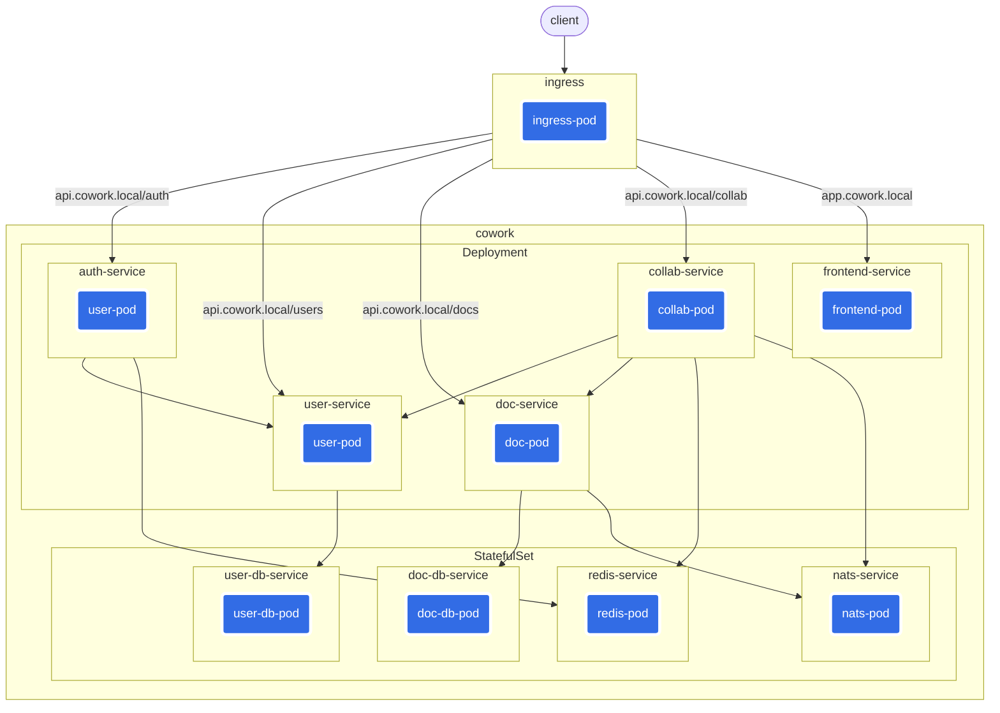

# Cowork
**Cowork** is an online real-time collaborative editing system, internal use of [Yjs CRDT](https://github.com/yjs/yjs) algorithm.

## Architecture

## Usage
Install dependencies `docker`, [docker-buildx](https://github.com/docker/buildx), [minikube](https://minikube.sigs.k8s.io/docs/), `kubectl`, `make` and start the `minikube`
- build the image
```shell
chmod +x ./scripts/*
make
```
- deployment
```shell
kubectl apply -f ./k8s
```
- update hosts, need permission to modify the hosts file.
```shell
sudo ./scripts/host.sh
```
- waiting all pods start, execute to view the pods status
```shell
kubectl get pods -n cowork
```
open the [app.cowork.local](http://app.cowork.local)

## TODO
- [ ] usage
- [ ] document
- [ ] cowork-frontend
- [ ] cowork-group

## Reference
- [Yjs](https://github.com/yjs/yjs)
- [Yjs Internals](https://github.com/yjs/yjs/blob/main/INTERNALS.md)
- [Yjs: A Framework for Near Real-Time P2P Shared Editing on Arbitrary Data Types](http://dbis.rwth-aachen.de/~derntl/papers/preprints/icwe2015-preprint.pdf)
- [Real Differences between OT and CRDT for Co-Editors](https://arxiv.org/ftp/arxiv/papers/1810/1810.02137.pdf)