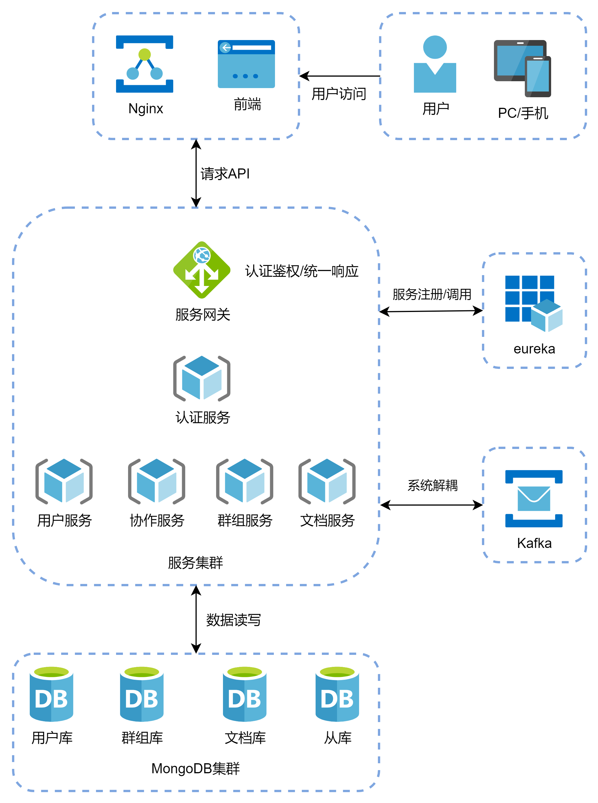

# Cowork


## 项目介绍
Cowork是一个在线实时协同编辑系统，前端编辑器使用了开源的[Quill](https://github.com/quilljs/quill)，支持富文本编辑。<br>协同编辑算法基于[CRDT](https://en.wikipedia.org/wiki/Conflict-free_replicated_data_type)，目前算法在特定情况下还有问题尚待修复。前端的CRDT算法是基于数组实现的，时间复杂度为O(n)，待后续优化为树形结构。




## 模块说明

| 目录             | 说明     | 端口号 |
| ---------------- | -------- | ------ |
| cowork-admin     | 后台模块 | 8087   |
| cowork-auth      | 认证模块 | 8083   |
| cowork-collab    | 协作模块 | 8085   |
| cowork-common    | 公共包   | 无     |
| cowork-config    | 配置中心 | 8888   |
| cowork-dashboard | 后台前端 | 9090   |
| cowork-doc       | 文档模块 | 8084   |
| cowork-eureka    | 注册中心 | 8761   |
| cowork-frontend  | 系统前端 | 8080   |
| cowork-gateawy   | 网关模块 | 8081   |
| cowork-group     | 群组模块 | 8086   |
| cowork-user      | 用户模块 | 8082   |

## Docker 使用
安装`npm`、`maven`、`docker`、`docker-compose`
- 克隆仓库
```
git clone https://github.com/shiroyk/Cowork.git
```
- 编译后端
```
cd Cowork
mvn package -Dmaven.test.skip=true
```
- 编译前端
```
cd cowork-frontend 
npm install
npm run build
cd -
```
- 启动
```
docker-compose up --build
```
访问地址`http://localhost:8080`<br>
启动需要较长的时间，需要耐心等待
## 参考
 - [Logical clock](https://en.wikipedia.org/wiki/Logical_clock)
 - [Causal ordering](https://scattered-thoughts.net/writing/causal-ordering/)
 - [Causal trees: towards real-time read-write hypertext](http://citeseerx.ist.psu.edu/viewdoc/download?doi=10.1.1.627.5286&rep=rep1&type=pdf)
 - [Yjs: A Framework for Near Real-Time P2P Shared Editing on Arbitrary Data Types](http://dbis.rwth-aachen.de/~derntl/papers/preprints/icwe2015-preprint.pdf)
 - [Data Laced with History: Causal Trees & Operational CRDTs](http://archagon.net/blog/2018/03/24/data-laced-with-history/)
 - [Real Differences between OT and CRDT for Co-Editors](https://arxiv.org/ftp/arxiv/papers/1810/1810.02137.pdf)
 - [Yjs](https://github.com/yjs/yjs)
 - [xi-editor](https://github.com/xi-editor/xi-editor/blob/master/docs/docs/crdt.md)
 - [conclave](https://github.com/conclave-team/conclave)