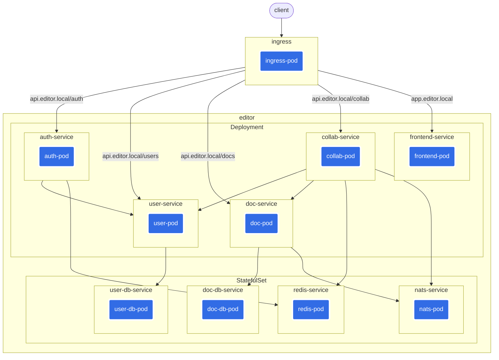

# crdt-editor
**crdt-editor** is an online real-time collaborative editing system, internal use of [Yjs CRDT](https://github.com/yjs/yjs) algorithm.

## Architecture

```mermaid
graph TB
classDef pod fill:#326ce5,stroke:#fff,stroke-width:4px,color:#fff;
client([client]) --> ingress
subgraph ingress
    ingress-pod(ingress-pod):::pod
end
subgraph editor
    subgraph Deployment
        subgraph auth-service
            auth-pod(auth-pod):::pod
        end
        subgraph user-service
            user-pod(user-pod):::pod
        end
        subgraph doc-service
            doc-pod(doc-pod):::pod
        end
        subgraph collab-service
            collab-pod(collab-pod):::pod
        end
        subgraph frontend-service
            frontend-pod(frontend-pod):::pod
        end
    end
    subgraph StatefulSet
        subgraph redis-service
            redis-pod(redis-pod):::pod
        end
        subgraph nats-service
            nats-pod(nats-pod):::pod
        end
        subgraph user-db-service
            user-db-pod(user-db-pod):::pod
        end
        subgraph doc-db-service
            doc-db-pod(doc-db-pod):::pod
        end
    end
    user-service --> user-db-service
    auth-service --> user-service
    collab-service --> user-service
    doc-service --> doc-db-service
    collab-service --> doc-service
    doc-service --> nats-service
    auth-service --> redis-service
    collab-service --> redis-service
    collab-service --> nats-service
end
ingress -- api.editor.local/auth --> auth-service
ingress -- api.editor.local/users --> user-service
ingress -- api.editor.local/docs --> doc-service
ingress -- api.editor.local/collab --> collab-service
ingress -- app.editor.local --> frontend-service
```
## Usage
Install dependencies `docker`, [docker-buildx](https://github.com/docker/buildx), [minikube](https://minikube.sigs.k8s.io/docs/), `kubectl`, `make` and start the `minikube`
- build the image
```shell
chmod +x ./scripts/*
make
```
- start
```shell
./scripts/start.sh
```
- update hosts, need permission to modify the hosts file.
```shell
export INGRESS_IP=$(kubectl get svc -n ingress-nginx ingress-nginx-controller -o=jsonpath='{.spec.clusterIP}')
sudo cat << EOF >> /etc/hosts
$INGRESS_IP api.editor.local
$INGRESS_IP app.editor.local
$INGRESS_IP dashboard.editor.local
EOF
```
- waiting all pods start, execute to view the pods status
```shell
kubectl get pods -n editor
```
open the page
- [app.editor.local](http://app.editor.local)
- [dashboard.editor.local](https://dashboard.editor.local)

## Reference
- [Yjs](https://github.com/yjs/yjs)