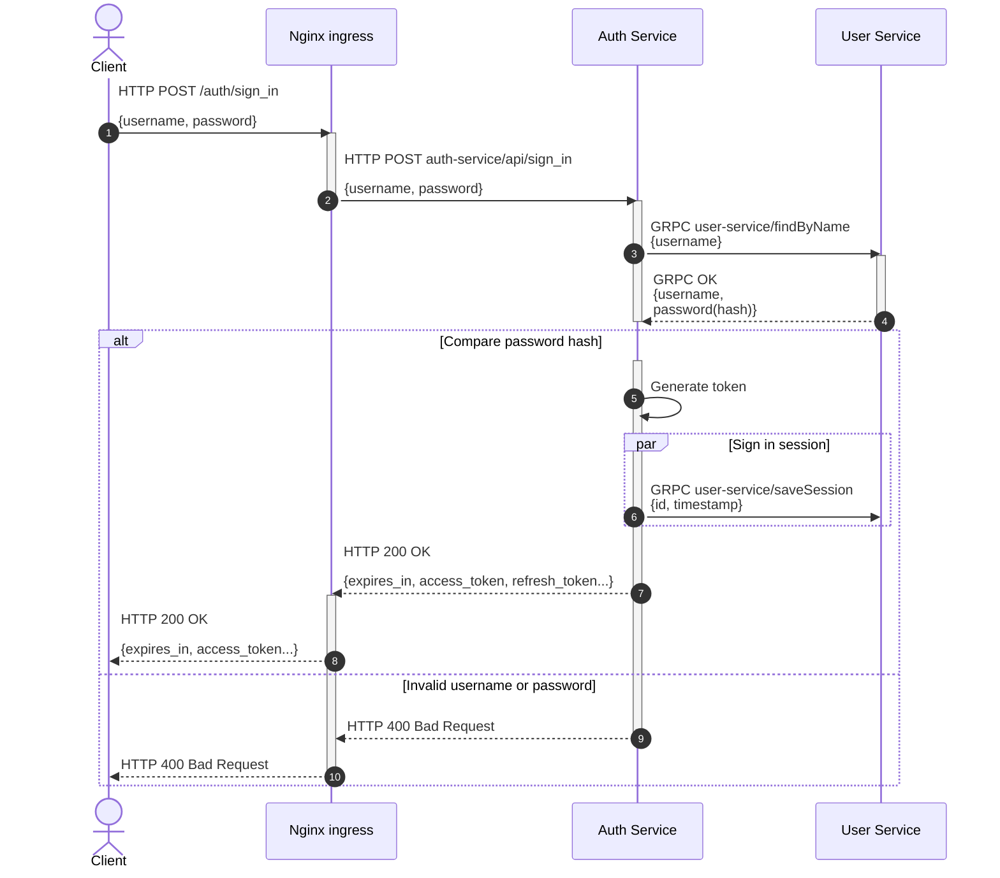
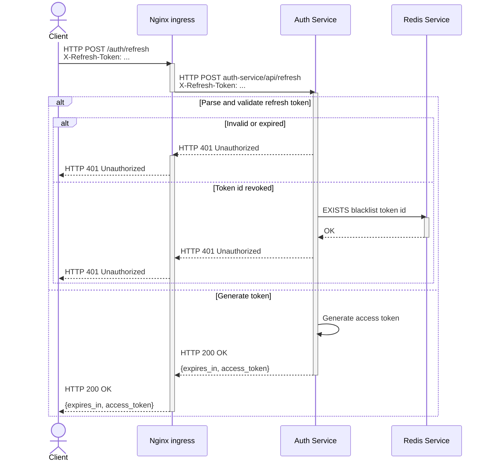
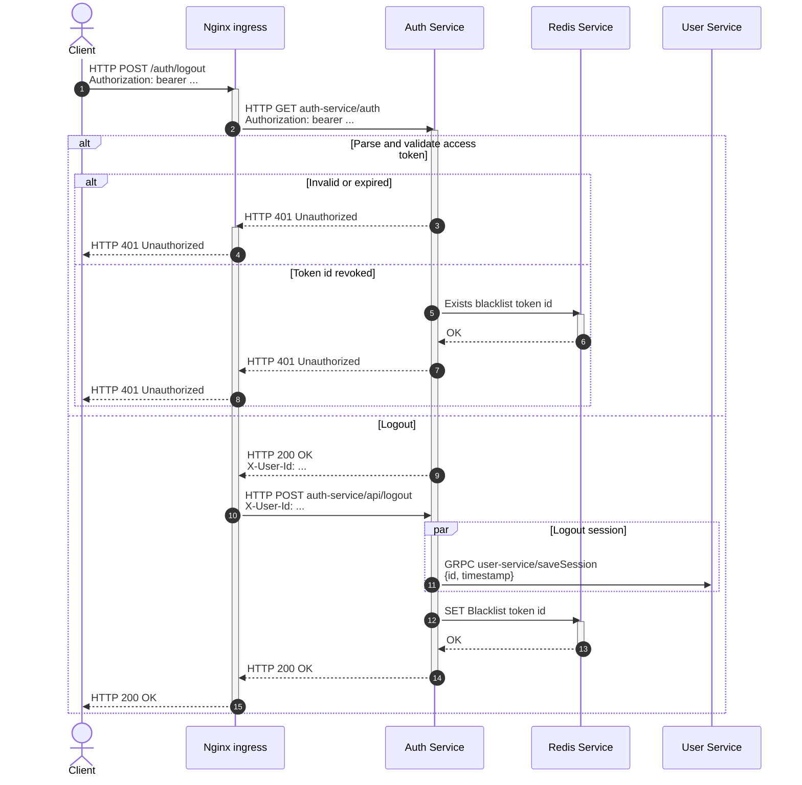

# Auth sequence diagrams

## /auth/sign_in

```mermaid
%%{init:{ "sequence": { "messageAlign": "left"} }}%%
sequenceDiagram
    autonumber
    actor client as Client
    participant nginx as Nginx ingress
    participant auth as Auth Service
    participant user as User Service

    client ->> nginx: HTTP POST /auth/sign_in <br><br> {username, password}
    activate nginx
    nginx ->> auth: HTTP POST auth-service/api/sign_in <br><br> {username, password}
    deactivate nginx
    activate auth

    auth ->> user: GRPC user-service/findByName <br>{username}
    activate user
    user -->> auth: GRPC OK <br>{username, <br>password(hash)}
    deactivate auth
    deactivate user
    
    alt Compare password hash
        activate auth
        auth ->> auth: Generate token
        par Sign in session 
            auth ->> user: GRPC user-service/saveSession <br> {id, timestamp}
        end
        auth -->> nginx: HTTP 200 OK <br><br> {expires_in, access_token, refresh_token...}
        activate nginx
        nginx -->> client: HTTP 200 OK <br><br> {expires_in, access_token...}
    else Invalid username or password
        auth -->> nginx: HTTP 400 Bad Request
        deactivate auth
        nginx -->> client: HTTP 400 Bad Request
        deactivate nginx
    end
```
## /auth/refresh

```mermaid
%%{init:{ "sequence": { "messageAlign": "left"} }}%%
sequenceDiagram
    actor client as Client
    participant nginx as Nginx ingress
    participant auth as Auth Service
    participant redis as Redis Service

    client ->> nginx: HTTP POST /auth/refresh <br> X-Refresh-Token: ...
    activate nginx
    nginx ->> auth: HTTP POST auth-service/api/refresh <br> X-Refresh-Token: ...
    deactivate nginx
    activate auth

    alt Parse and validate refresh token
        alt Invalid or expired
            auth -->> nginx: HTTP 401 Unauthorized
            activate nginx
            nginx -->> client: HTTP 401 Unauthorized
        else Token id revoked
            auth ->> redis: EXISTS blacklist token id
            activate redis
            redis -->> auth: OK
            deactivate redis
            auth -->> nginx: HTTP 401 Unauthorized
            nginx -->> client: HTTP 401 Unauthorized
        end 
    else Generate token
        auth ->> auth: Generate access token
        auth -->> nginx: HTTP 200 OK <br><br> {expires_in, access_token}
        deactivate auth
        nginx -->> client: HTTP 200 OK <br><br> {expires_in, access_token}
        deactivate nginx
    end
```
## /auth/logout

```mermaid
%%{init:{ "sequence": { "messageAlign": "left"} }}%%
sequenceDiagram
    autonumber
    actor client as Client
    participant nginx as Nginx ingress
    participant auth as Auth Service
    participant redis as Redis Service
    participant user as User Service

    client ->> nginx: HTTP POST /auth/logout <br> Authorization: bearer ...
    activate nginx
    nginx ->> auth: HTTP GET auth-service/auth <br> Authorization: bearer ...
    deactivate nginx
    activate auth

    alt Parse and validate access token
        alt Invalid or expired
            auth -->> nginx: HTTP 401 Unauthorized
            activate nginx
            nginx -->> client: HTTP 401 Unauthorized
        else Token id revoked
            auth ->> redis: Exists blacklist token id
            activate redis
            redis -->> auth: OK
            deactivate redis
            auth -->> nginx: HTTP 401 Unauthorized
            nginx -->> client: HTTP 401 Unauthorized
        end
    else Logout
        auth -->> nginx: HTTP 200 OK <br> X-User-Id: ...
        nginx ->> auth: HTTP POST auth-service/api/logout <br> X-User-Id: ...
        par Logout session
            auth ->> user: GRPC user-service/saveSession <br> {id, timestamp}
        end
        auth ->> redis: SET Blacklist token id
        activate redis
        redis -->> auth: OK
        deactivate redis
        auth -->> nginx: HTTP 200 OK
        deactivate auth
        nginx -->> client: HTTP 200 OK
        deactivate nginx
    end
```