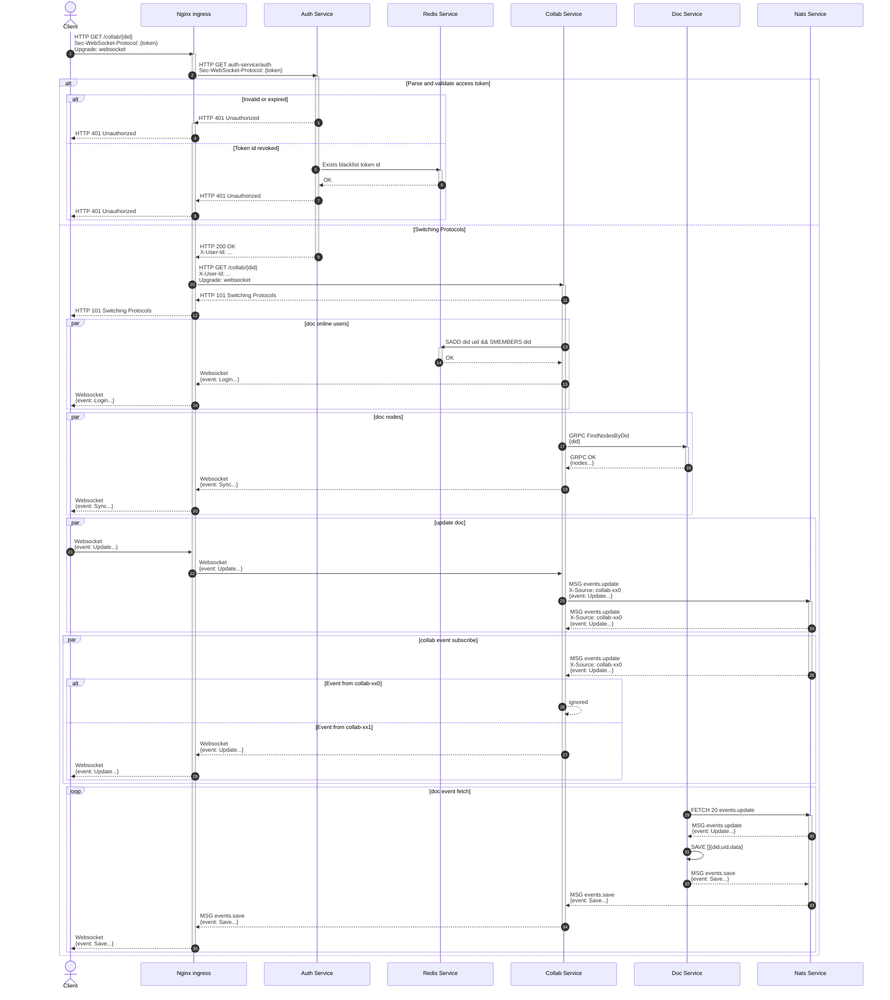

# Collab sequence diagrams

## /collab/{did}

```mermaid
%%{init:{ "sequence": { "messageAlign": "left", "width": 300 } }}%%
sequenceDiagram
    autonumber
    actor client as Client
    participant nginx as Nginx ingress
    participant auth as Auth Service
    participant redis as Redis Service
    participant collab as Collab Service
    participant doc as Doc Service
    participant nats as Nats Service

    client ->> nginx: HTTP GET /collab/{did} <br> Sec-WebSocket-Protocol: {token} <br> Upgrade: websocket
    activate nginx
    nginx ->> auth: HTTP GET auth-service/auth <br> Sec-WebSocket-Protocol: {token}
    deactivate nginx
    activate auth

    alt Parse and validate access token
        alt Invalid or expired
            auth -->> nginx: HTTP 401 Unauthorized
            activate nginx
            nginx -->> client: HTTP 401 Unauthorized
        else Token id revoked
            auth ->> redis: Exists blacklist token id
            activate redis
            redis -->> auth: OK
            deactivate redis
            auth -->> nginx: HTTP 401 Unauthorized
            nginx -->> client: HTTP 401 Unauthorized
        end
    else Switching Protocols
        auth -->> nginx: HTTP 200 OK <br> X-User-Id: ...
        deactivate auth
        nginx ->> collab: HTTP GET /collab/{did} <br> X-User-Id: ... <br> Upgrade: websocket
        activate collab
        collab -->> nginx: HTTP 101 Switching Protocols
        nginx -->> client: HTTP 101 Switching Protocols
        par doc online users
            collab ->> redis: SADD did uid && SMEMBERS did
            activate redis
            redis -->> collab: OK
            deactivate redis
            collab -->> nginx: Websocket <br> {event: Login...}
            nginx -->> client: Websocket <br> {event: Login...}
        end
        par doc nodes
            collab ->> doc: GRPC FindNodesByDid <br> {did}
            activate doc
            doc -->> collab: GRPC OK <br>{nodes...}
            deactivate doc
            collab -->> nginx: Websocket <br> {event: Sync...}
            nginx -->> client: Websocket <br> {event: Sync...}
        end
        par update doc
            client ->> nginx: Websocket <br> {event: Update...}
            nginx ->> collab: Websocket <br> {event: Update...}
            collab ->> nats: MSG events.update <br> X-Source: collab-xx0 <br> {event: Update...}
            activate nats
            nats -->> collab: MSG events.update <br> X-Source: collab-xx0 <br> {event: Update...}
        end
        par collab event subscribe
            nats -->> collab: MSG events.update <br> X-Source: collab-xx0 <br> {event: Update...}
            deactivate nats
            alt Event from collab-xx0
                collab -->> collab: ignored
            else Event from collab-xx1
                collab -->> nginx: Websocket <br> {event: Update...}
                nginx -->> client: Websocket <br> {event: Update...}
            end
        end
        loop doc event fetch
            doc ->> nats: FETCH 20 events.update
            activate nats
            nats -->> doc: MSG events.update <br> {event: Update...}
            doc ->> doc: SAVE []{did,uid,data}
            doc -->> nats: MSG events.save <br> {event: Save...}
            nats -->> collab: MSG events.save <br> {event: Save...}
            deactivate nats
            collab -->> nginx: MSG events.save <br> {event: Save...}
            deactivate collab
            nginx -->> client: Websocket <br> {event: Save...}
        end
        deactivate nginx
    end
```