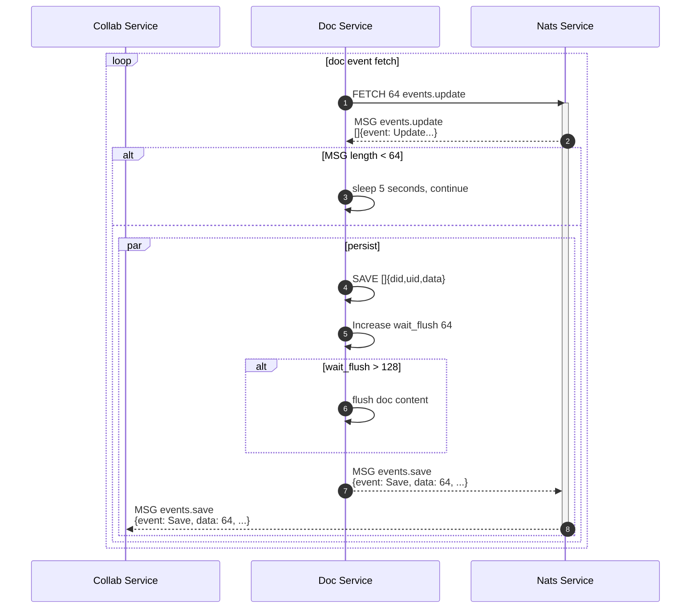

# Doc sequence diagrams

## Persistence

```mermaid
%%{init:{ "sequence": { "messageAlign": "left", "width": 300 } }}%%
sequenceDiagram
    autonumber
    participant collab as Collab Service
    participant doc as Doc Service
    participant nats as Nats Service

    loop doc event fetch
        doc ->> nats: FETCH 64 events.update
        activate nats
        nats -->> doc: MSG events.update <br> []{event: Update...}
        alt MSG length < 64
            doc ->> doc: sleep 5 seconds, continue
        else
            par persist
                doc ->> doc: SAVE []{did,uid,data}
                doc ->> doc: Increase wait_flush 64
                alt wait_flush > 128
                    doc ->> doc: flush doc content
                end
                doc -->> nats: MSG events.save <br> {event: Save, data: 64, ...}
                nats -->> collab: MSG events.save <br> {event: Save, data: 64, ...}
                deactivate nats
            end
        end
    end
```