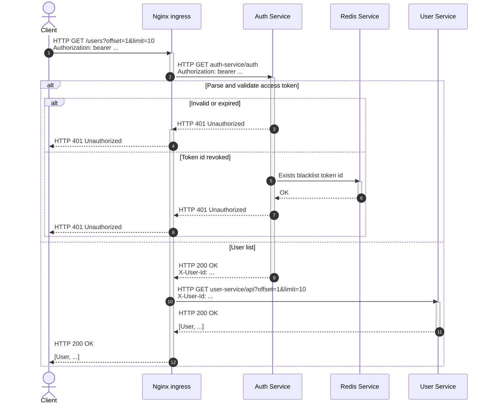

## /users

```mermaid
%%{init:{ "sequence": { "messageAlign": "left"} }}%%
sequenceDiagram
    autonumber
    actor client as Client
    participant nginx as Nginx ingress
    participant auth as Auth Service
    participant redis as Redis Service
    participant user as User Service
    
    client ->> nginx: HTTP GET /users?offset=1&limit=10 <br> Authorization: bearer ...
    activate nginx
    nginx ->> auth: HTTP GET auth-service/auth <br> Authorization: bearer ...
    deactivate nginx
    activate auth
    
    alt Parse and validate access token
        alt Invalid or expired
            auth -->> nginx: HTTP 401 Unauthorized
            activate nginx
            nginx -->> client: HTTP 401 Unauthorized
        else Token id revoked
            auth ->> redis: Exists blacklist token id
            activate redis
            redis -->> auth: OK
            deactivate redis
            auth -->> nginx: HTTP 401 Unauthorized
            nginx -->> client: HTTP 401 Unauthorized
        end
    else User list
        auth -->> nginx: HTTP 200 OK <br> X-User-Id: ...
        deactivate auth
        nginx ->> user: HTTP GET user-service/api?offset=1&limit=10 <br> X-User-Id: ...
        activate user
        user -->> nginx: HTTP 200 OK <br><br> [User, ...]
        deactivate user
        nginx -->> client: HTTP 200 OK <br><br> [User, ...]
        deactivate nginx
    end
```